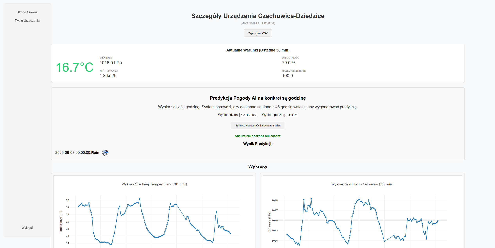

# ISS-Server - Inteligentna Stacja Pogodowa

[](https://opensource.org/licenses/MIT)

Inteligentna stacja pogodowa z funkcją interpretacji i predykcji stanu pogody z wykorzystaniem uczenia maszynowego. Aplikacja webowa napisana w Pythonie (Flask) pozwala na monitorowanie danych z prywatnej stacji pogodowej, zarządzanie urządzeniami oraz uruchamianie modelu AI do prognozowania warunków na podstawie danych historycznych.



## Kluczowe Funkcje

*   **System Użytkowników:** Rejestracja i logowanie w celu uzyskania dostępu do prywatnych stacji.
*   **Zarządzanie Urządzeniami:** Możliwość dodawania i przypisywania urządzeń (stacji pogodowych) do konta użytkownika oraz nadawania im przyjaznych nazw.
*   **Wizualizacja Danych:**
    *   Panel "Aktualne Warunki" pokazujący zagregowane dane z ostatnich 30 minut.
    *   Interaktywne wykresy (temperatura, ciśnienie) prezentujące dane w 30-minutowych interwałach.
*   **Predykcja AI na Żądanie:**
    *   Możliwość wyboru konkretnej daty i godziny w celu uruchomienia predykcji.
    *   System weryfikuje, czy dostępne jest wystarczająco dużo danych historycznych (48 godzin) do przeprowadzenia analizy.
    *   Asynchroniczna obsługa zadań AI (w osobnym wątku), aby nie blokować interfejsu użytkownika.
*   **Hierarchiczny Model Predykcyjny:** Wykorzystanie zaawansowanego, hierarchicznego modelu XGBoost do klasyfikacji stanu pogody na podstawie ponad 100 wygenerowanych cech.
*   **Eksport Danych:** Możliwość pobrania surowych, niezagregowanych danych pomiarowych w formacie CSV.

## Architektura i Stos Technologiczny

Aplikacja opiera się na klasycznej architekturze webowej z serwerem backendowym i renderowanym frontem.

*   **Backend:** Python 3, Flask
*   **Baza Danych:** SQLite
*   **Uczenie Maszynowe:**
    *   **Model:** XGBoost
    *   **Przetwarzanie danych:** Pandas, NumPy
    *   **Biblioteki pomocnicze:** Scikit-learn, Joblib
*   **Frontend:**
    *   HTML5 / CSS3
    *   JavaScript (Vanilla JS)
    *   **Wykresy:** Plotly.js

## Struktura Projektu

```
ISS-SERVER/
├── routes/             # Logika poszczególnych podstron (Flask Blueprints)
│   ├── ai_service.py   # Endpointy do uruchamiania i sprawdzania statusu AI
│   ├── boards.py       # Zarządzanie urządzeniami użytkownika
│   ├── device_data.py  # Wyświetlanie danych, agregacja, eksport CSV
│   └── ...             # Inne trasy (home, login, etc.)
├── static/             # Pliki statyczne (CSS, obrazy ikon pogody)
├── templates/          # Szablony HTML (Jinja2)
├── trained_models_wien/ # Wytrenowane modele AI (.json) i enkodery (.pkl)
├── ai_main.py          # Główny moduł AI do przetwarzania danych i predykcji
├── app.py              # Główny plik aplikacji Flask, inicjalizacja i routing
├── config.py           # Konfiguracja aplikacji
├── measurements.db     # Baza danych SQLite
└── README.md
```

## Instalacja i Uruchomienie

Aby uruchomić projekt lokalnie, postępuj zgodnie z poniższymi krokami:

1.  **Sklonuj repozytorium:**
    ```bash
    git clone https://github.com/Tomciom/ISS-Server.git
    cd ISS-Server
    ```

2.  **Utwórz i aktywuj wirtualne środowisko (zalecane):**
    ```bash
    # Windows
    python -m venv venv
    .\venv\Scripts\activate

    # macOS / Linux
    python3 -m venv venv
    source venv/bin/activate
    ```

3.  **Zainstaluj wymagane biblioteki:**
    ```bash
    pip install -r requirements.txt
    ```

4.  **Uruchom aplikację:**
    ```bash
    python app.py
    ```
    Aplikacja zostanie uruchomiona na `http://localhost:5000`. `app.py` automatycznie utworzy i zainicjalizuje bazę danych `measurements.db` przy pierwszym uruchomieniu.

## Sposób Działania Modelu AI

Mechanizm predykcji jest sercem projektu. Jego działanie można opisać w kilku krokach:

1.  **Inicjacja przez Użytkownika:** Użytkownik wybiera datę i godzinę, na którą chce uzyskać predykcję.
2.  **Pobieranie Danych:** System pobiera z bazy SQLite surowe dane z 48 godzin poprzedzających wybraną godzinę.
3.  **Agregacja i Inżynieria Cech:** Dane są agregowane do interwałów godzinowych. Następnie skrypt `ai_main.py` generuje ponad 100 cech, w tym m.in.:
    *   Wartości opóźnione (np. temperatura 6 godzin temu).
    *   Różnice czasowe (np. zmiana ciśnienia w ciągu ostatniej godziny).
    *   Statystyki kroczące (średnia, min, max, std z okien 3, 6, 12, 24h).
    *   Flagi binarne (np. `flag_near_freezing`, `flag_windy_and_precip`).
    *   Brakujące dane (NaN) powstałe w tym procesie są uzupełniane (imputowane), aby zapewnić ciągłość.
4.  **Hierarchiczna Predykcja:** Wytrenowany model XGBoost dokonuje predykcji w kilku etapach:
    *   **Model 1:** Rozstrzyga, czy wystąpią opady (`Opady` vs `Brak Opadów`).
    *   **Model 2 (jeśli brak opadów):** Rozróżnia `Mgła` od pozostałych warunków bezopadowych.
    *   **Model 3 (jeśli są opady):** Klasyfikuje typ opadu (`Deszcz`, `Śnieg`, `Burza`).
    *   **Model 4 (jeśli brak mgły i opadów):** Rozróżnia `Czyste Niebo/Lekkie Zachmurzenie` od `Pochmurno/Całkowite Zachmurzenie`.
5.  **Zwrócenie Wyniku:** Ostateczna, sklasyfikowana kategoria pogodowa jest zwracana do interfejsu użytkownika i prezentowana wraz z odpowiednią ikoną.

## Licencja

Projekt jest dystrybuowany na licencji MIT. Zobacz plik `LICENSE`, aby uzyskać więcej informacji.

## Autorzy

**Tomasz Madeja** - [Tomciom](https://github.com/Tomciom)
**Michał Krzempek** - [miskrz0421](https://github.com/miskrz0421)
**Kacper Machnik** - [KacperMachnik](https://github.com/KacperMachnik)
